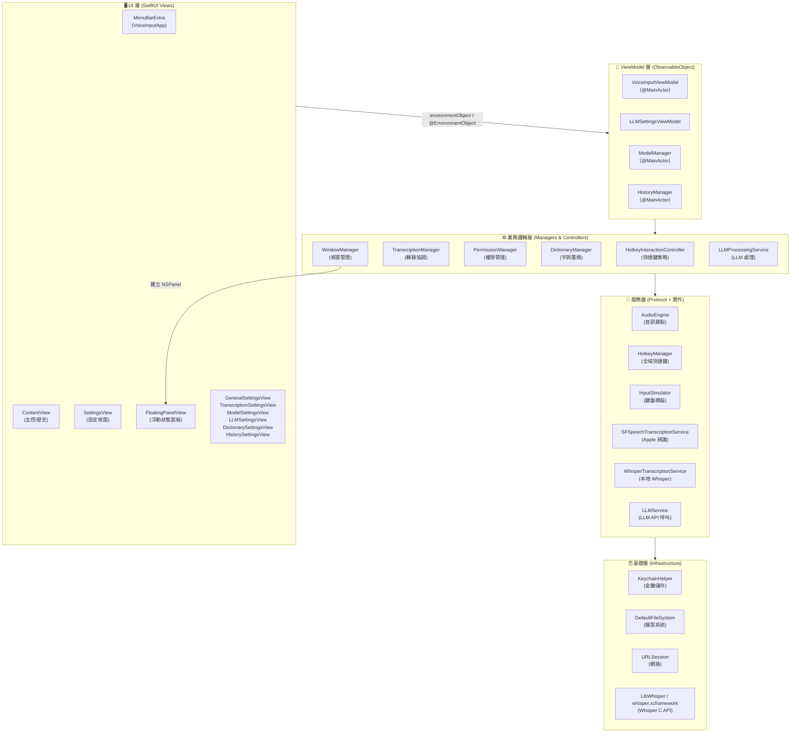
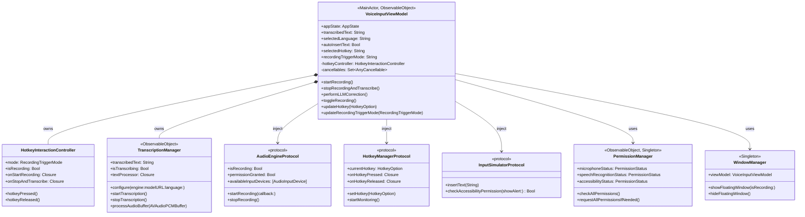
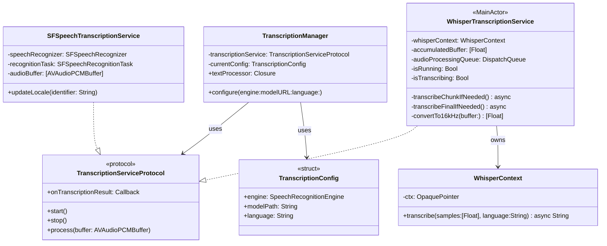
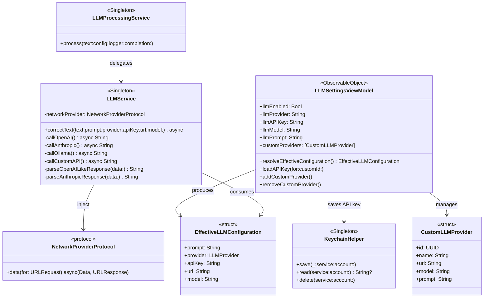
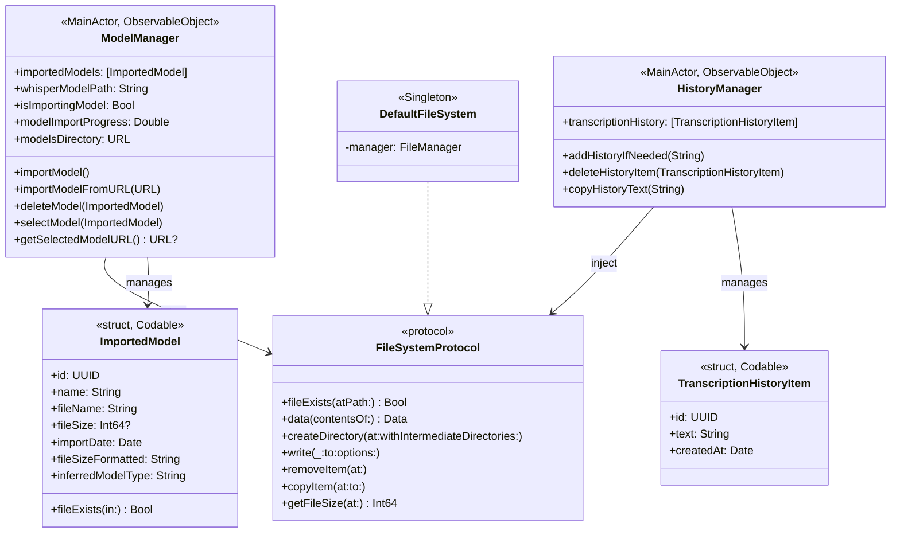
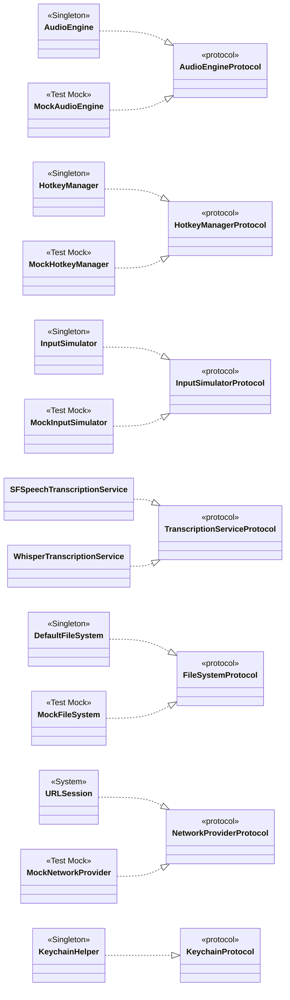
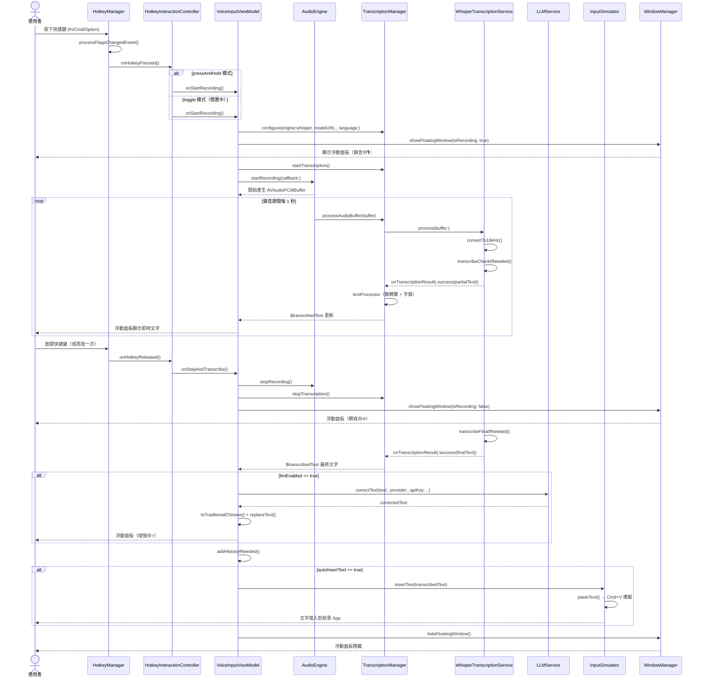
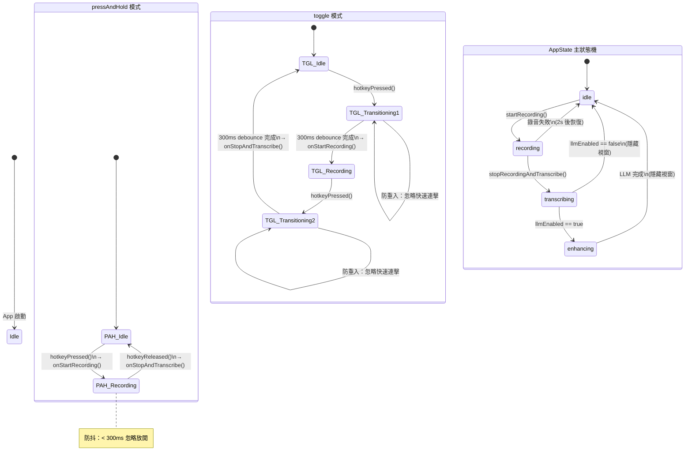
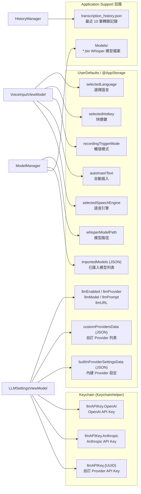

# VoiceInput 系統架構說明

**分析日期：** 2026-02-25

---

## 一、系統概覽

VoiceInput 是一個 macOS MenuBar App，核心功能為：監聽全域快捷鍵 → 錄製麥克風音訊 → 語音轉文字 → (可選 LLM 修正) → 自動插入到前景應用程式。

整體採用 **SwiftUI + MVVM + Protocol-Oriented** 架構，搭配大量 **依賴注入 (DI)** 以便單元測試。

---

## 二、系統分層架構圖



---

## 三、核心類別關係圖

### 3-1 VoiceInputViewModel 核心依賴



### 3-2 轉錄服務層



### 3-3 LLM 服務層



### 3-4 Model 與 History 管理



---

## 四、協議與實作對應圖



---

## 五、錄音到輸入的完整序列圖



---

## 六、快捷鍵狀態機



---

## 七、LLM Provider 選擇流程

```mermaid
flowchart TD
    A[使用者開啟 LLM 設定] --> B{選擇 Provider}

    B --> C[OpenAI]
    B --> D[Anthropic]
    B --> E[Ollama]
    B --> F[自訂 Provider]

    C --> C1[輸入 API Key\n儲存到 Keychain]
    C --> C2[設定模型名稱\ngpt-4o-mini 預設]

    D --> D1[輸入 API Key\n儲存到 Keychain]
    D --> D2[設定模型名稱\nclaude-3-haiku 預設]

    E --> E1[設定 URL\nlocalhost:11434 預設]
    E --> E2[設定模型名稱\nllama3 預設]

    F --> F1[新增 CustomLLMProvider\n{名稱, URL, 模型, Prompt}]
    F --> F2[API Key 存入 Keychain\n以 UUID 為 account key]

    C1 & C2 & D1 & D2 & E1 & E2 & F1 & F2 --> G[resolveEffectiveConfiguration()]

    G --> H[EffectiveLLMConfiguration\n{prompt, provider, apiKey, url, model}]

    H --> I[LLMProcessingService.process()]
    I --> J[LLMService.correctText()]

    J --> K{provider}
    K --> L[callOpenAI\nPOST api.openai.com]
    K --> M[callAnthropic\nPOST api.anthropic.com]
    K --> N[callOllama\nPOST localhost:11434/v1/chat/completions]
    K --> O[callCustomAPI\nPOST 自訂 URL]

    L & M & N & O --> P[parseResponse]
    P --> Q{成功?}
    Q --> |Yes| R[修正後文字回傳 VoiceInputViewModel]
    Q --> |No| S[LLMServiceError\n→ lastLLMError 顯示於浮動面板]
```

---

## 八、資料持久化策略



---

## 九、架構特色與設計決策摘要

### 協議驅動設計 (Protocol-Oriented Design)
所有核心服務均定義於協議（`AudioEngineProtocol`、`HotkeyManagerProtocol` 等），實際實作與測試 Mock 均實作相同協議。`VoiceInputViewModel` 透過建構子注入，可在測試中替換為 Mock，不需要啟動真正的麥克風或快捷鍵監聽。

### 分層職責分離
| 層次 | 負責範圍 | 代表類別 |
|------|---------|---------|
| UI 層 | 畫面渲染、使用者互動 | `ContentView`、`FloatingPanelView` |
| ViewModel 層 | 應用程式狀態、業務協調 | `VoiceInputViewModel`、`LLMSettingsViewModel` |
| Controller 層 | 單一職責的轉換邏輯 | `HotkeyInteractionController`、`TranscriptionManager` |
| 服務層 | 系統 API 封裝 | `AudioEngine`、`HotkeyManager`、`LLMService` |
| 基礎層 | 平台抽象 | `DefaultFileSystem`、`KeychainHelper` |

### 資料安全策略
- **API Key** 一律存入 **Keychain**，不存於 UserDefaults
- 每個 Provider（包含自訂）以獨立 account key 存儲，互不干擾
- 實際 API 請求前重新從 Keychain 讀取，確保使用最新金鑰

### 並發策略
- `VoiceInputViewModel`、`ModelManager`、`HistoryManager` 標記 `@MainActor`
- `WhisperTranscriptionService` 的音訊處理在獨立 `DispatchQueue` 執行，切回 MainActor 才修改狀態
- `HotkeyManager` 的 CGEventTap callback 透過 `DispatchQueue.main.async` 回到主執行緒

### 快捷鍵架構（三層解耦）
```
CGEventTap（系統層）
    ↓ keyCode + flags
HotkeyManager（訊號層）— 純粹的「按下/放開」事件派送
    ↓ onPressed / onReleased
HotkeyInteractionController（策略層）— 依模式決定語意
    ↓ onStartRecording / onStopAndTranscribe
VoiceInputViewModel（業務層）— 執行錄音流程
```
