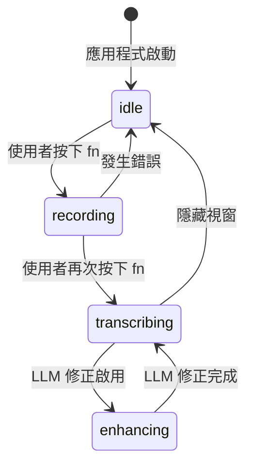

# 語音輸入流程詳細說明

## 流程圖

```mermaid
flowchart TD
    %% 節點样式定義
    classDef startend fill:#e1f5fe,stroke:#01579b,stroke-width:2px,rx:5,ry:5
    classDef process fill:#fff3e0,stroke:#e65100,stroke-width:1px
    classDef decision fill:#e8f5e9,stroke:#2e7d32,stroke-width:1px
    classDef state fill:#f3e5f5,stroke:#7b1fa2,stroke-width:1px

    subgraph 開始階段
        A1[使用者按下 fn 鍵]:::startend --> A2{目前狀態}
        A2 -->|閒置狀態| A3[開始錄音]:::process
        A2 -->|錄音中| A4[停止錄音]:::process
        A3 --> A5[初始化轉錄服務]:::process
        A5 --> A6[設定辨識語言]:::process
        A6 --> A7[appState = .recording]:::state
        A7 --> A8[顯示浮動視窗]:::process
        A8 --> A9[AudioEngine 開始錄音]:::process
    end

    subgraph 錄音階段
        A9 --> R1[收集音頻數據]:::process
        R1 --> R2{使用者再次按下 fn?}:::decision
        R2 -->|否| R1
        R2 -->|是| S1[停止錄音]:::process
    end

    subgraph 停止與轉寫
        S1 --> S2[appState = .transcribing]:::state
        S2 --> S3[顯示浮動視窗<br/>轉寫模式]:::process
        S3 --> S4[延遲 0.5 秒]:::process
        S4 --> S5[finishTranscribing]:::process
    end

    subgraph 文字處理流程
        S5 --> T1[取得辨識結果]:::process
        T1 --> T2{文字有效?}:::decision
        T2 -->|否| T6[隱藏浮動視窗]:::process
        T2 -->|是| T3{啟用 LLM 修正?}:::decision
        T3 -->|否| T4[簡體轉繁體]:::process
        T3 -->|是| T5[進入增強狀態<br/>appState = .enhancing]:::state
        T5 --> L1[呼叫 LLM API]:::process
        L1 --> L2[取得修正後文字]:::process
        L2 --> L3{簡體轉繁體}:::decision
        L3 -->|是| L4[轉換為繁體中文]:::process
        L3 -->|否| L5
        L4 --> L5[字典替換]:::process
        T4 --> T5b[字典替換]:::process
        T5b --> T7[proceedToInsertAndHide]:::process
        L5 --> T7
    end

    subgraph 輸出階段
        T7 --> O1[添加歷史記錄]:::process
        O1 --> O2{自動插入文字?}:::decision
        O2 -->|否| O5
        O2 -->|是| O3[請求輔助權限]:::process
        O3 --> O4{權限 granted?}:::decision
        O4 -->|是| O6[InputSimulator.insertText]:::process
        O4 -->|否| O5
        O6 --> O5
        O5[隱藏浮動視窗]:::process
        O5 --> O6b[重置狀態<br/>appState = .idle]:::state
    end

    %% 連線樣式
    style A1 fill:#e1f5fe,stroke:#01579b,stroke-width:2px
    style O6b fill:#e1f5fe,stroke:#01579b,stroke-width:2px
```



## 詳細流程說明

### 1. 開始階段

| 步驟 | 說明 | 程式碼位置 |
|------|------|------------|
| 1.1 | 使用者按下 `fn` 鍵觸發語音輸入 | `NSEvent.flagsChanged` 事件 |
| 1.2 | 檢查目前狀態，決定開始或停止錄音 | `VoiceInputViewModel.swift:717` |
| 1.3 | 初始化轉錄服務（Apple Speech 或 Whisper） | `VoiceInputViewModel.swift:724-747` |
| 1.4 | 設定辨識語言（zh-TW, zh-CN, en-US, ja-JP） | `VoiceInputViewModel.swift:731-733` |
| 1.5 | 設定狀態為 `.recording` | `appState = .recording` |
| 1.6 | 顯示浮動狀態視窗 | `WindowManager.shared.showFloatingWindow(isRecording: true)` |
| 1.7 | `AudioEngine` 開始收集音頻數據 | `AudioEngine.swift:171` |

### 2. 錄音階段

| 步驟 | 說明 |
|------|------|
| 2.1 | `AudioEngine` 持續收集麥克風輸入的音頻數據 |
| 2.2 | 即時將音頻數據傳送給轉錄服務進行即時辨識（可選） |
| 2.3 | 使用者再次按下 `fn` 鍵停止錄音 |

### 3. 停止與轉寫

| 步驟 | 說明 | 程式碼位置 |
|------|------|------------|
| 3.1 | 停止 `AudioEngine` 錄音 | `audioEngine.stopRecording()` |
| 3.2 | 停止轉錄服務 | `transcriptionService.stop()` |
| 3.3 | 切換狀態為 `.transcribing` | `VoiceInputViewModel.swift:850` |
| 3.4 | 顯示浮動視窗（轉寫模式） | `VoiceInputViewModel.swift:853` |
| 3.5 | 延遲 0.5 秒讓使用者看到轉寫動畫 | `VoiceInputViewModel.swift:856` |
| 3.6 | 呼叫 `finishTranscribing()` 完成轉寫 | `VoiceInputViewModel.swift:857` |

### 4. 文字處理流程

#### 4.1 取得辨識結果

從轉錄服務取得原始辨識文字：
- **Apple Speech**: `SFSpeechTranscriptionService` 回調
- **Whisper**: `WhisperTranscriptionService` 回調

#### 4.2 文字有效性檢查

```swift
let hasValidText = !transcribedText.isEmpty &&
                  !transcribedText.hasPrefix("識別錯誤：") &&
                  transcribedText != "等待輸入..."
```

若無效文字，直接隱藏浮動視窗。

#### 4.3 簡體中文轉繁體中文

如果選擇的語言是 `zh-TW`（繁體中文），會將識別結果從簡體中文轉換為繁體中文：

```swift
if self?.selectedLanguage == "zh-TW" {
    processedText = text.toTraditionalChinese()
}
```

使用 Core Foundation 的 `CFStringTransform` API 進行轉換。

#### 4.4 字典替換

使用 `DictionaryManager` 進行自訂詞彙替換：

```swift
processedText = DictionaryManager.shared.replaceText(processedText)
```

**替換規則**：
- 只處理 `isEnabled == true` 的項目
- 按照原始字串長度由長到短排序（避免短字串先被替換）
- 使用不區分大小寫的比對方式

### 5. LLM 修正（可選）

如果設定中啟用了 LLM 修正功能，會進行以下流程：

| 步驟 | 說明 | 程式碼位置 |
|------|------|------------|
| 5.1 | 設定狀態為 `.enhancing` | `VoiceInputViewModel.swift:872` |
| 5.2 | 呼叫 LLM API 進行文字增強 | `performLLMCorrection()` |
| 5.3 | 取得修正後的文字 | `VoiceInputViewModel.swift:902` |
| 5.4 | 再次進行簡轉繁（如適用） | `VoiceInputViewModel.swift:905-906` |
| 5.5 | 再次進行字典替換 | `VoiceInputViewModel.swift:910` |

### 6. 輸出階段

#### 6.1 添加歷史記錄

將轉錄結果添加到歷史記錄（僅保留最近 10 筆）：

```swift
addTranscriptionHistoryIfNeeded(transcribedText)
```

#### 6.2 自動插入文字

如果設定中啟用了「自動插入」功能：

1. 檢查輔助功能權限（Accessibility）
2. 若無權限，請求用戶授權
3. 授權成功後，使用 `InputSimulator` 模擬鍵盤輸入將文字插入到當前焦點的輸入框

```swift
inputSimulator.insertText(self.transcribedText)
```

#### 6.3 隱藏浮動視窗

- 延遲 0.1 秒確保焦點切換完成
- 隱藏浮動視窗
- 重置狀態為 `.idle`

## 狀態機



## 關鍵類別與函數

| 類別/結構 | 職責 |
|-----------|------|
| `VoiceInputViewModel` | 主要 ViewModel，管理整個語音輸入流程 |
| `AudioEngine` | 處理麥克風錄音 |
| `SFSpeechTranscriptionService` | Apple 內建語音辨識服務 |
| `WhisperTranscriptionService` | Whisper 模型語音辨識服務 |
| `DictionaryManager` | 管理自訂詞彙字典和替換邏輯 |
| `InputSimulator` | 模擬鍵盤輸入文字到目標應用 |
| `WindowManager` | 管理浮動視窗的顯示與隱藏 |
| `PermissionManager` | 管理權限請求（麥克風、語音辨識、輔助功能） |

## 錯誤處理

| 錯誤情況 | 處理方式 |
|----------|----------|
| 麥克風權限被拒絕 | 顯示提示訊息，引導用戶至系統偏好設定 |
| 語音辨識失敗 | 顯示「識別錯誤：XXX」訊息 |
| Whisper 模型不存在 | 提示用戶設定中選擇有效的模型檔案 |
| LLM API 呼叫失敗 | 記錄錯誤但保留原文繼續執行 |
| 輔助功能權限被拒絕 | 不執行自動插入，仍顯示結果 |
